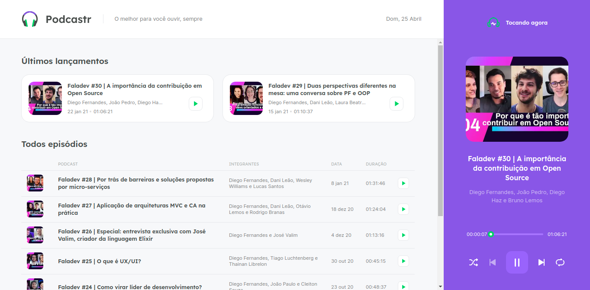
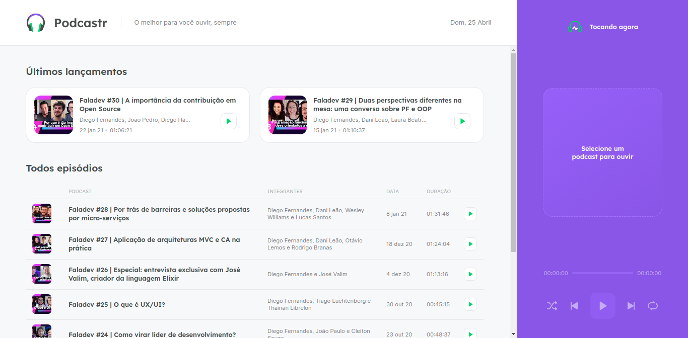
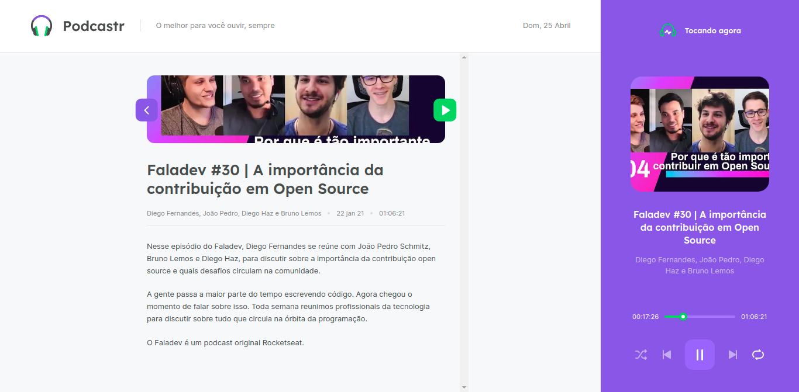
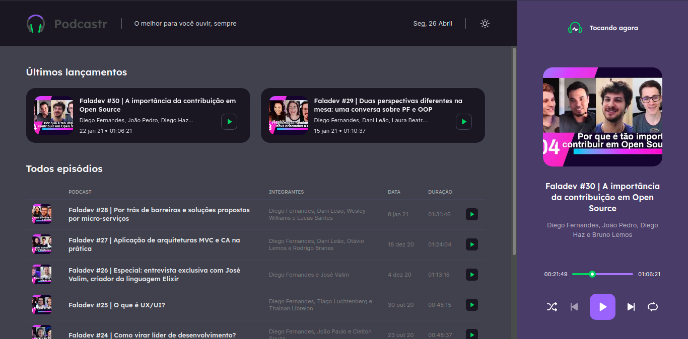
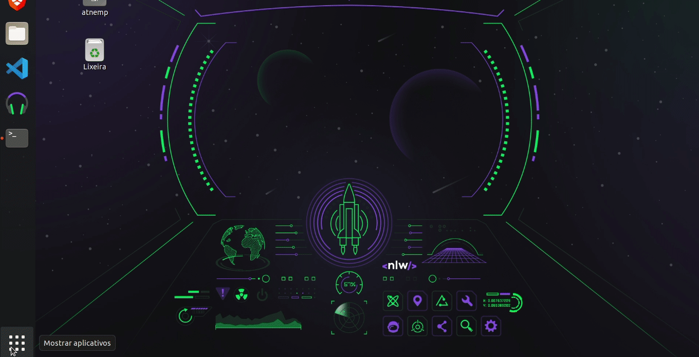

    <h1> Podcastr - NLW#5 - Trilha ReactJS</h1>
     

    

# Projeto

Projeto desenvolvido durante a trilha de React.js na NextLevelWeek5, da [Rocketseat](https://rocketseat.com.br/).

O Podcastr é uma aplicação para o podcast FalaDev, da Rocketseat. Temos o player que conta com funcionalidades de loop, embaralhar lista de reprodução, avançar na lista e voltar.

Nós usamos o Next.js para gerar as páginas estaticamente. A home é gerada estaticamente e as páginas dos episódios são geradas como páginas dinâmicas estáticas, páginas que não são geradas estaticamente na hora da build, mas assim que alguém entra na página e ela realiza as requisições, a página é armazenada como estática.

Eu fui um pouco além e implementei algumas features que não foram desenvolvidas durante a NLW, são elas:

- Dark Mode
- Theme Switcher
- Progressive Web App (PWA)

## Tecnologias e linguagens usadas

- React
- Next.js
- SASS
- JSON Server
- Libs:
  - rc-slider
  - date-fns
  - next-pwa

## Preview

    
    
(Página inicial, sem podcast selecionado)

    
    
(Página do episódio)

    
    
(Apresentação do Dark Mode)

    
    
(Apresentação da PWA)

